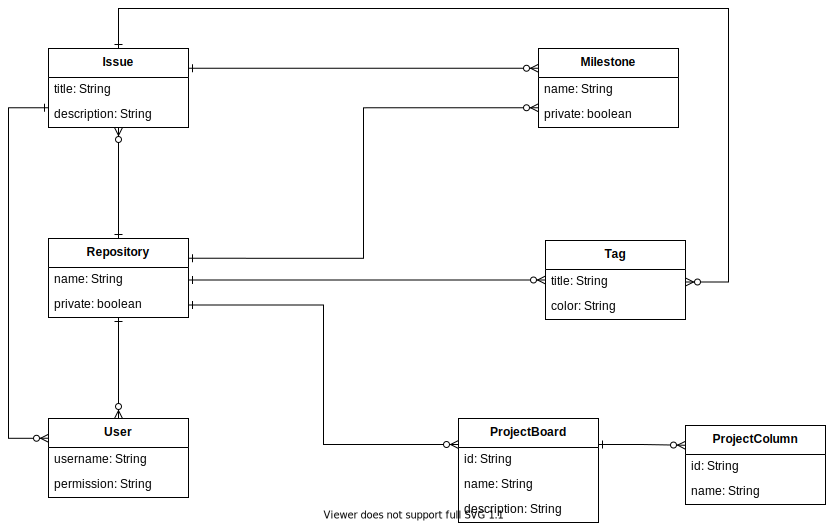

# ITSI-GITSI (README OBSOLETO!!, no hacer caso)
ITSI-GITSI es una herramienta para la generación y gestión automática de repos de GIT Hub, en principio tenemos como objetivos de la herramienta que sea capaz de hacer las siguientes cosas.

1. Generación automática de repos con una plantilla generada a partir de una propuesta de metamodelo.
  * Esta plantilla deberá ser capaz de definir etiquetas para issues, crear milestones en el proyecto e intentar realizar invitaciones automáticas de usuarios a los proyectos generados.
2. Calculador de notas de usuarios de los repos, teniendo en cuenta que issues han resuelto, bien simplemente medianta la contabilizzación unitaria de esos issues (de uno en uno) o utilizando posibles tags de puntuación del issue.
3. Modificar automáticamente un Markdown en el repo para de manera automática plasmar las notas en el mismo.

## Posible Metamodelo de plantilla de repo
Para modifical el metamodelo utilizar la extensión `drawio` en visual studio code. OLD!!!


# Consideraciónes de uso de la herramienta.
En la carpeta examples teneis una serie de ejemplos de las distintas operaciones que podreís realizar con la herramienta.

## Requisitos y .env
Lo primero que debeis tener instalado en el ordenador es la última versión estable de [Node.js](https://nodejs.org/en/) en vuestro ordenador. Una vez comprobada la instalación de `Node.js` debeis modificar el archivo `.env.test` con vuestros datos de Github y eliminar la extensión `.test` del mismo. En principio necesitareis los siguientes paramentros.

* PERSONAL_ACCESS_TOKEN. Un token que podeis crear en la interfaz de [github](https://github.com/settings/tokens), es importante que para que la herramienta funcione correctamente debeis ser `owners` de la organización en la que vais a crear los repos. Al generar el token, generarlo con todos los permisos posibles para evitar posibles errores y no os olvideis de guardar el mismo dado que no podreís volver a consultarlo, y una pérdida de este supondría tener que volver a hacer la generación de token.

## Instalación de dependencias
Para el correcto funcionamiento de la herramienta lo primero que hay que hacer es instalar las dependencias del proyecto. Para ello debeis ejecutar en la carpeta raiz del proyecto la orden: 
```
npm install .
```

## Ejecutar la herramienta
...

### TODO

### Collaborators
* **Manel Mena** -  [https://github.com/manelme](https://github.com/manelme).
* **Javier Criado** -  [https://github.com/javicriado](https://github.com/javicriado).
